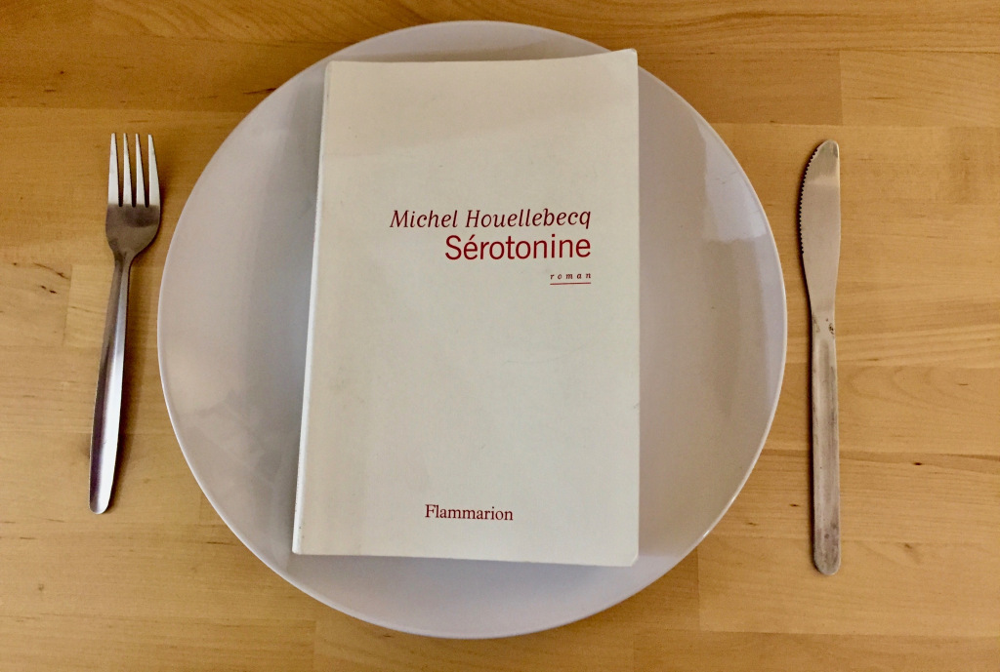

Składniki: główny bohater w wieku średnim o skłonnościach depresyjnych,   kilka refleksji natury socjologicznej, garstka opisów cielesnych, kilka fragmentów erotycznych, szczypta cynizmu i humoru. Dowolnie wymieszać niniejsze elementy na stronach najlepiej trzystustronicowej powieści.

Ten przepis zastosowany po raz pierwszy w „Poszerzeniu pola walki” (1994) i udoskonalony w „Cząstkach elementarnych” przyniósł najpierw Houellebecqowi globalny sukces komercyjny (to zdecydowanie najbardziej znany francuski autor naszych czasów), potem uznanie krytyki zwieńczone nagrodą Goncourt za “Mapę i terytorium” w 2010. Zatytułowana “Serotonina”, jego siódma powieść wydana na początku roku we Francji stosuje komponenty typowo używane przez tego powieściopisarza.

“Serotonina” to historia Florenta-Clauda – przygnębionego czterdziestolatka, który znajduje się w ślepym zaułku życia zawodowego i uczuciowego. Podobnie jak w poprzednich powieściach, Houellebecq gra rolę pisarza-socjologa, którego ambicją jest sportretowanie współczesnej mu epoki. Jego nowy tekst fetyszyzuje ponadto tematykę cielesną: opisy wyglądu zewnętrznego są bardzo precyzyjne (s. 120)* ; ciało często metonimicznie zredukowane jest do narządu zdolnego zaspokoić (bądź też przeciwnie) potrzeby libidynalne (s. 133), idea starzenia się jako dewaluacji na rynku seksualnym jest również obecna (Ibid.). Autor-pornograf, Houellebecq, ponownie stosuje surowe opisy aktu seksualnego. Jak zwykle nie brakuje mu poczucia humoru, toteż jego tekst bawi nas tyle samo, co wzrusza. Niestety mimo że Houellebecq posługuje się pewnym dopracowanym do perfekcji przepisem, “Serotonina” okazuje się być produktem miernym niezadowalającym oczekiwań koneserów. Użyte składniki zdają się być gorszej jakości, a sam mistrz stracił jakby nieco własny warsztat.

Jesteśmy dla przykładu zaskoczeni niektórymi rozwiązaniami narratologicznymi. Kiedy główny bohater Florent-Claude decyduje się opuścić swoją japońską partnerkę, postanawia on wypowiedzieć umowę najmu mieszkania, zwolnić się ze stanowiska w ministerstwie rolnictwa i zniknąć na kilka miesięcy, mając nadzieję, że to zachęci jego dziewczynę (nie mogącą pozwolić sobie tym samym na przyzwoite zakwaterowanie) do powrotu do Japonii. Zastanawiamy się, po co tyle kombinacji i jak cierpiący na depresję bliski załamania mężczyzna był w stanie podjąć tyle przedsięwzięć, jednocześnie nie będąc w stanie stawić czoła swojej dziewczynie. Zabieg z pewnością efektowny, ale mało prawdopodobny.

Mamy czasami wrażenie, że Houellebecq stara się za wszelką cenę nadać intrydze dodatkowej dramaturgii, co wbrew jego zamiarom sprawia, że jego dzieło staje się nijakie i mało wyrafinowane. Miałem takie wrażenie, czytając między innymi rozdział o proteście normandzkich rolników, który kończy się samobójczą śmiercią przyjaciela głównego bohatera (Aymerica). Fragment ten – mający z pewnością na celu podkreślenie desperacji francuskich rolników bezbronnych (sic !) wobec postępującego procesu globalizacji – zdał mi się ckliwy i bezużyteczny dla całości przebiegu akcji.

“Serotonina” zawiera poza tym zbyt wiele wątków wynikających z przypadku. I tak, poza kamerzystą popularnego kanału informacyjnego, Florent-Claude jest jedynym naocznym świadkiem ostatnich minut życia swojego znajomego rolnika, bo służby specjalne przeoczyły przez przypadek jego obecność (s. 260). Główny bohater może potwierdzić swoje wątpliwości o pedofilskich skłonnościach pewnego urlopowicza, bo ten ostatni zapomniał przez przypadek zamknąć drzwi na klucz ;protagoniście udaje się ponadto zalogować do komputera pedofila, bo przez przypadek żadne hasło nie jest wymagane (s. 214-218). Florent-Claude zdoła niemalże zastrzelić dziecko byłej partnerki, bo przez przypadek zamieszkuje ona całkowicie odizolowany dom, znajdujący się naprzeciwko opuszczonej zimą restauracji, której okna wychodzą wprost na taras domu kobiety (s. 302-304). Te idealne do wyeliminowania niechcianej istoty warunki potęguje również fakt, że niania, zamiast zajmować się swoim podopiecznym, woli spędzać popołudnie na pierwszym piętrze  słuchając muzyki ze szczelnymi słuchawkami na uszach.

Jesteśmy również rozczarowani motywami społecznymi, których intensywny aromat sprawił niegdyś, że dzieło Houellebecqa stało się dobrze rozpoznawalnym daniem. Francuski autor, którego przenikliwość socjologiczna  doprowadziła wielu czytelników i krytyków do przekonania, że obdarzony jest on darem proroctwa, zadawala się tym razem powielaniem wyrażonych wielokrotnie wcześniej  idei – zanik życia seksualnego na Zachodzie (s. 329), prostytucja jako szlachetny niezbędny do prawidłowego funkcjonowania każdego społeczeństwa zawód (s. 318), podział jednostek na klasy według wyglądu („arystokracja piękna”), a co za tym idzie, ich wartość na rynku cielesnym (s. 323) – do tego stopnia, że odnosimy wrażenie czytania fragmentów “Platformy” i “Poszerzenia Pola Walki”. Główny problem, o którym mowa w “Serotoninie”, upadek francuskiego rolnictwa, okazuje się mdły, niezdolny dotknąć przeciętnego czytelnika czy zachęcić go do refleksji.

Jesteśmy skądinąd zdumieni tematyką seksualną. Zestawiany niekiedy z Sadem, Houellebecq zyskał sławę dzięki odważnym scenom, uważanym często za nieprzyzwoite lub pornograficzne. Powieściopisarz nie tylko chce pozostać tyleż samo prowokacyjny, ale stara się prześcignąć siebie samego, podnieść poprzeczkę jeszcze wyżej. Ponieważ jesteśmy przyzwyczajeni do zuchwałości jego opisów, a sam autor nie jest już w stanie nas łatwo zszokować, odwołuje się on do tematów tabu, takich jak zoofilia (s. 54) i pedofilia (s. 156), co niestety pozostawia gorzki smak, którego przez długi czas trudno nam się pozbyć.

Byłoby jednak niesprawiedliwe nazwać “Serotoninę” całkowicie nieudaną powieścią. Nowy tekst Houellebecqa jest bowiem piękną refleksją o życiu człowieka Zachodu, który, mimo dobrobytu gospodarczego, postępu technicznego i naukowego, co raz to silniejszej tendencji do indywidualizmu, oraz ciągłej dewaluacji relacji z bliźnim, pozostaje bezbronną istotą niezdolną do życia bez odrobiny czułości. “Serotonina” jest bowiem pochwałą więzi miłosnej, jedynego uczucia mogącego nas ocalić. Wyrzeczenie się go jest równoznaczne ze skazaniem siebie samego na powolną bolesną i nieuniknioną śmierć.

Pozostaje tylko mieć nadzieję, że Houellebecq będzie w stanie przeobrazić się w swojej kolejnej książce, że ponownie stanie się kucharzem, którego umiejętności i oryginalne przepisy uwiodły podniebienie najbardziej wybrednych krytyków i czytelników z całego świata.

 

Texte: Pawel Hladki